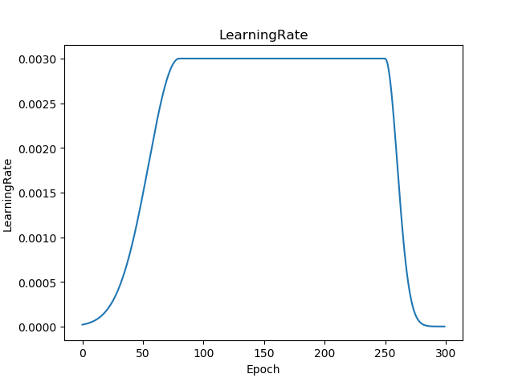
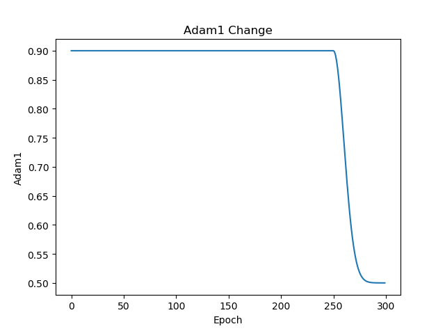
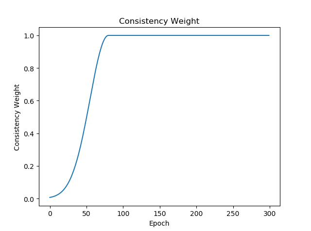

# semi-supervised-paper-implementation

This repository is designed to reproduce the methods in some semi-supervised papers.

Before running the code, you need to install the packages according to the following command.

```python
pip3 install https://download.pytorch.org/whl/cu80/torch-0.4.1-cp36-cp36m-linux_x86_64.whl # pytorch version should be 0.4.1
pip3 install torchvision
pip3 install tensorflow # we use tensorboard in the project
```


## Prepare datasets

### CIFAR-10

Use the following command to unpack the data and generate labeled data path files. 

```python
python3 -m semi_supervised.core.utils.cifar10
```


## Run on CIFAR-10

To run on CIFAR-10, 

run

```python
CUDA_VISIBLE_DEVICES=0 python3 -m semi_supervised.experiments.temporal_ensembling.cifar10_test
```

to reproduce the result in [Temporal Ensembling for Semi-Supervised Learning](https://arxiv.org/abs/1610.02242).

run

```python
CUDA_VISIBLE_DEVICES=0 python3 -m semi_supervised.experiments.mean_teacher.cifar10_test
```

to reproduce the result in [Mean teachers are better role models](https://arxiv.org/abs/1703.01780).

*Note: This code does not be tested on multiple GPUs, so there is no guarantee that the result is good on multiple GPUs.*


## Results on CIFAR-10

| Number of Labeled Data                                       | 1000      | 2000      | 4000      | All labels |
| ------------------------------------------------------------ | --------- | --------- | --------- | ---------- |
| Pi model (from [Mean teachers are better role models](https://arxiv.org/abs/1703.01780)) | 72.64     | **81.98** | 86.8      | 93.94      |
| **Pi model (this repository)**                              | **74.35** | 81.68     | **87.22** | **94.26**  |
| Mean Teacher (from [Mean teachers are better role models](https://arxiv.org/abs/1703.01780)) | 78.45     | 84.27     | **87.69** | 94.06      |
| **Mean Teacher (this repository)**                           | **79.41** | **85.56** | 86.21     | **94.3**   |

It should be noted that the difference in results may come from the following two reasons:

1. Which images were selected as labeled data. This has a big impact on the results.
2. Seed set in experiments. In this experiment, seed is set to be 1000.


## Training strategies in semi-supervised learning

In semi-supervised learning, many papers use common training strategies. This section introduces some strategies I know.

### Learning rate

<a href="https://www.codecogs.com/eqnedit.php?latex=lr&space;=&space;rampup\_value&space;*&space;rampdown\_value&space;*&space;init\_lr" target="_blank"></a>

You can find out how to compute rampup_value and rampdown_value in semi_supervised/core/utils/fun_utils.py.

The curve of the learning rate is shown in the figure below.



### Optimizer

Many methods in semi-supervised learning use Adam optimizer with beta1 = 0.9 and beta2 = 0.999. During training, beta1 is dynamically changed.

<a href="https://www.codecogs.com/eqnedit.php?latex=adam\_beta1&space;=&space;rampdown\_value&space;*&space;0.9&space;&plus;&space;(1.0&space;-&space;rampdown\_value)&space;*&space;0.5" target="_blank"></a>

The curve of beta1 is shown in the figure below.



### Consistency Weight

Some methods use dynamically changed weight to balance supervised loss and unsupervised loss. 

<a href="https://www.codecogs.com/eqnedit.php?latex=weight&space;=&space;init\_weight&space;*&space;rampup\_value" target="_blank"></a>

The curve of consistency weight is shown in the figure below.




## TODO list

- [x] Mean Teacher
- [x] Pi Model
- [ ] Temporal Ensembling Model
- [ ] VAT
- [ ] More....


## References

1.  [Mean teachers are better role models](https://github.com/CuriousAI/mean-teacher)
2.  [Temporal Ensembling for Semi-Supervised Learning](https://github.com/smlaine2/tempens)
3.  [Good Semi-Supervised Learning that Requires a Bad GAN](https://github.com/kimiyoung/ssl_bad_gan)

4.  [Smooth Neighbors on Teacher Graphs for Semi-supervised Learning](https://github.com/xinmei9322/SNTG)

